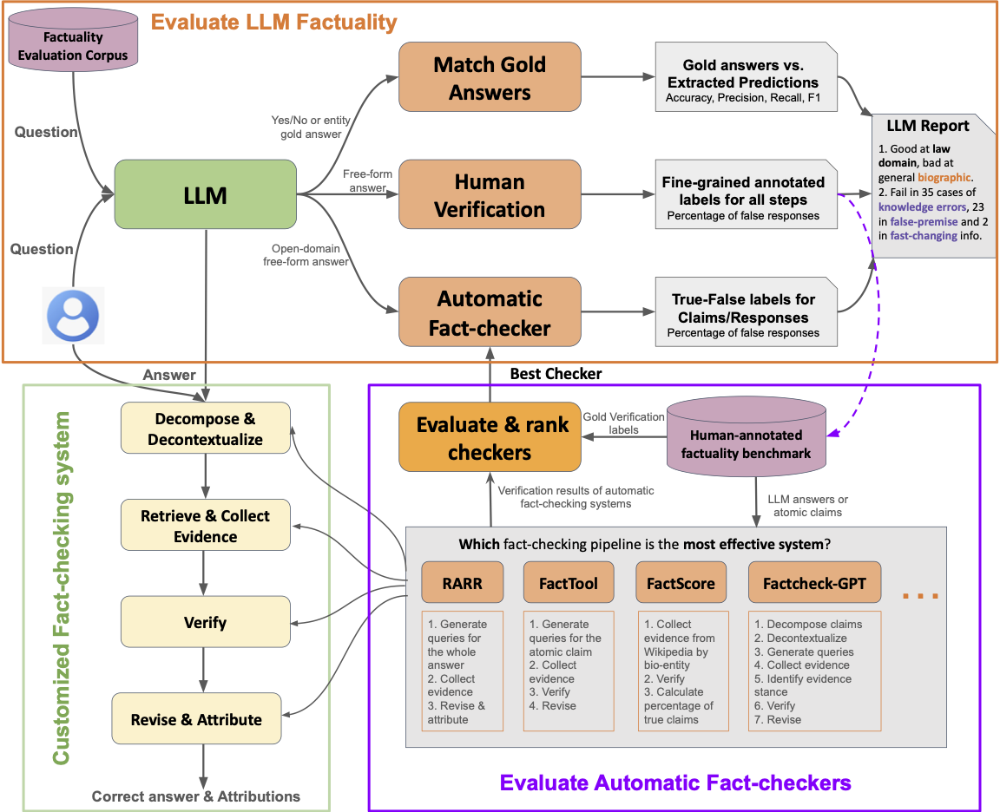

## OpenFactCheck: An Open-source Factuality Evaluation Demo for LLMs

<p align="center"> 

 </p>


OpenFactCheck is an open-source repository designed to facilitate the evaluation and enhancement of factuality in responses generated by large language models (LLMs). This project aims to integrate various fact-checking tools into a unified framework and provide comprehensive evaluation pipelines. It consists of three main components:

## Components

### Customized Fact-Checkers Pipeline

This module (`fact_checkers`) houses a collection of fact-checking implementations drawn from previous works. We've adapted these tools into our unified framework, making it easier for users to apply different fact-checking methods seamlessly to evaluate the factuality of information.

#### Supported Fact-Checkers
- [Factcheck GPT](https://arxiv.org/abs/2311.09000)
- [RARR](https://arxiv.org/abs/2210.08726)
- [Factool](https://arxiv.org/abs/2307.13528)

### Holistic Factuality Evaluation for LLM Responses

The `llm_factuality_eval` module is an automatic pipeline designed to assess the factuality of responses provided by LLMs. This component not only performs the evaluation but also includes an analysis component capable of automatically generating detailed reports. These reports provide insights into the accuracy and reliability of the evaluated content.

### Fact-Checker's Arena

Our `fact_checkers_eval` module features a pipeline and a leaderboard system to assess the performance of various fact-checking tools. Users can submit the outputs of their fact-checkers, and our system will evaluate them based on predefined criteria. The results are displayed on a leaderboard, allowing users to compare the effectiveness of different fact-checking tools.

## Getting Started

To get started with OpenFactCheck, clone this repository to your local machine:

```bash
git clone https://github.com/yuxiaw/OpenFactChecking.git
cd OpenFactChecking
```


## License
This project is licensed under the MIT License - see the LICENSE.md file for details.

## Citation
```
@article{wang2024openfactcheck,
      title={OpenFactCheck: A Unified Framework for Factuality Evaluation of LLMs}, 
      author={Yuxia Wang and Minghan Wang and Hasan Iqbal and Georgi Georgiev and Jiahui Geng and Preslav Nakov},
      year={2024},
      eprint={2405.05583},
      archivePrefix={arXiv},
      primaryClass={cs.CL}
}
```